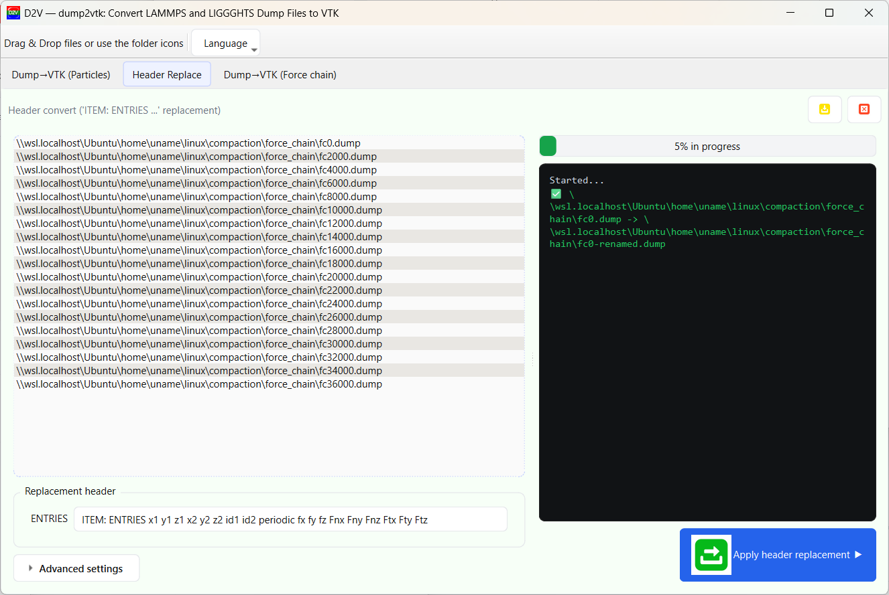
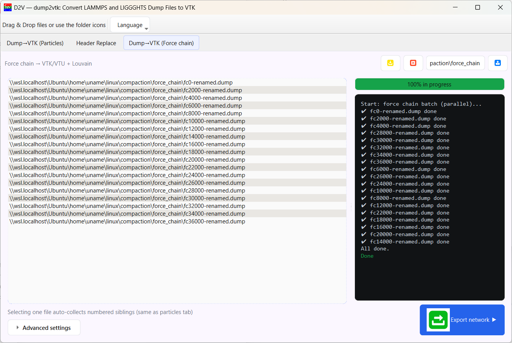
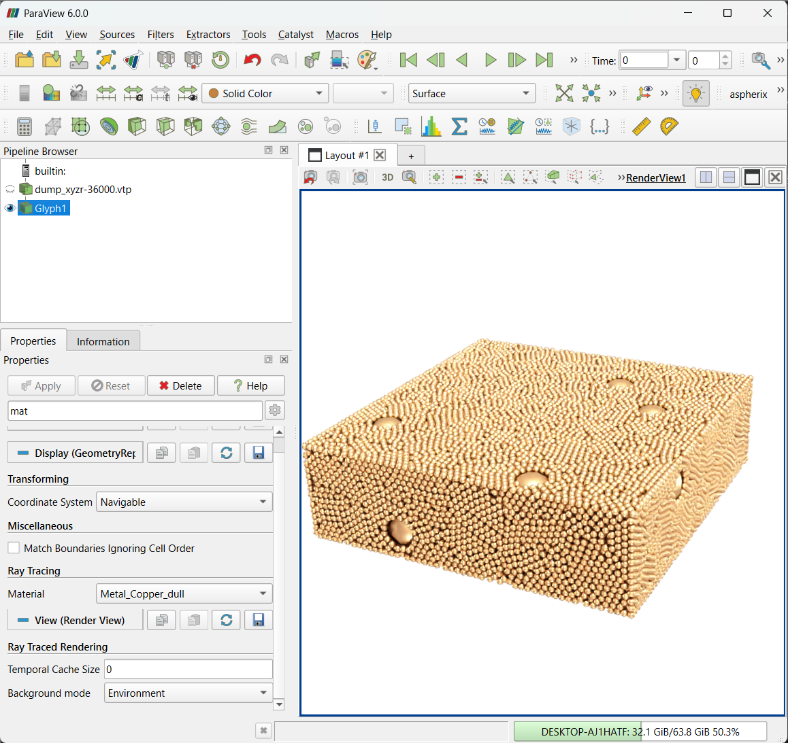
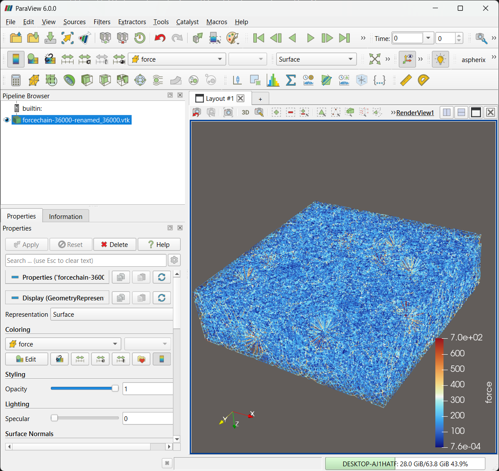
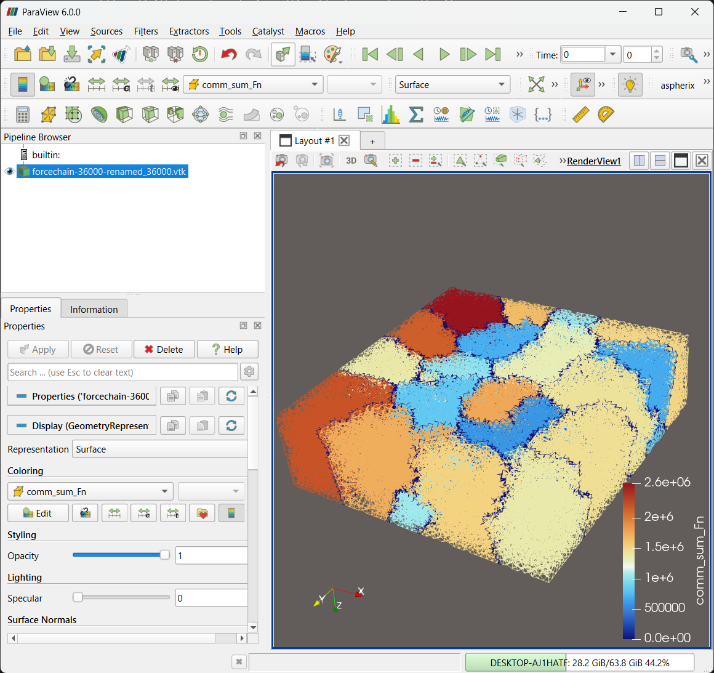

# dump2vtk（日本語）

LIGGGHTS/LAMMPS の dump を **VTK/VTU** に高速変換する単一ファイル **GUI + CLI** ツールです。  
粒子ダンプ、pair/local（force chain）ダンプ、ヘッダー置換を 1 本で扱えます。

- 主な特徴: 並列処理・チャンク処理、force chain の **ストリーミング読込**、自動連番収集（数字が末尾でなく**中間**にあっても検出）、Louvain によるコミュニティ検出と集約。
- 必要最小依存: `numpy`（GUI は `PySide6`、任意で `vtk` / `networkx` / `python-louvain`）。
- 英語版: [README_en.md](./README_en.md) ／ ライセンス: [LICENCE](./LICENCE)

---

## GUI の使い方

GUI は **3 タブ構成**です（下図参照）。

### Particles: Dump → VTK


1. 左のリストへ dump を **1 つドラッグ＆ドロップ**します。  
   同名プレフィクスの**連番ファイルを自動収集**します（数字の位置は末尾でも中間でも可）。
2. 右上の **出力先フォルダ**を必要に応じて指定します（空欄時は入力と同じ場所）。
3. **Advanced settings** では **ASCII/BINARY**、並列数、チャンクサイズ、`--no-overwrite`（既存スキップ）を設定します。  
   *注*: 現行実装ではバックエンドは **legacy/vtk を切り替え可能**（GUI/CLI どちらでも指定可）です。
4. **Export VTK** を押します。進捗バーとログに  
   `Start: particle VTK (parallel)... Done.` と表示されれば成功です。

---

### Header Replace: ヘッダー置換



1. pair/local 形式の dump（例: `fc0.dump, fc2000.dump, ...`）を投入します。  
   WSL パス（`\\wsl.localhost\...`）も扱えます。
2. **Replacement header** に以下の 1 行を入力します。  
   ```text
   ITEM: ENTRIES x1 y1 z1 x2 y2 z2 id1 id2 periodic fx fy fz Fnx Fny Fnz Ftx Fty Ftz
   ```
3. **Apply header replacement** を押します。各ファイルが `-renamed.dump` として複製されます。

---

### Force chain: フォースネットワーク（出力は VTK）



1. `*-renamed.dump` を **1 つ選ぶ**と、同プレフィクスの**連番**を自動収集します。
2. **Export network** を押します。各ステップの **VTK** を出力します。  
   ログに `Start: force chain batch (parallel)... All done.` が表示されれば完了です。

> 注: 現行実装は **VTK/VTU どちらも選択可能**（`--vtk-format {vtk|vtu}`）。

---

## VTK の出力例（ParaView）

本節では VTK ファイルの表示例を示します。粒子の例（下図左）、フォースチェーンの例（中央）、Louvain 法による力のネットワークの例（右）。


*図: VTK（粒子）*


*図: VTK（force chain）*


*図: VTK（Louvain 法）*

---

## CUI（CLI）
\* 本節では画像は配置しません。上節までの図が節をまたいで回り込まないよう、文中の構成は Markdown ベースに調整しています。

### `lpp`（粒子 Dump → VTK）
```bash
dump2vtk.exe lpp DUMP_FILES... ^
  -o OUTROOT --format {ascii|binary} ^
  --cpunum N --chunksize K --no-overwrite
```

### `rename`（ヘッダー置換）
```bash
dump2vtk.exe rename ^
  -H "ITEM: ENTRIES x1 y1 z1 x2 y2 z2 id1 id2 periodic fx fy fz Fnx Fny Fnz Ftx Fty Ftz" ^
  inputs*.dump --inplace
```

### `force`（フォースネットワーク + Louvain, 出力は VTK）
```bash
dump2vtk.exe force forcechain-*.dump ^
  --encoding {ascii|binary} --keep-periodic --resolution 1.0 --seed 42 ^
  --write-pointdata --outdir outdir/ --nan-fill 0.0 ^
  --cpunum N --chunksize K --no-overwrite
```

---
## 謝辞・ライセンス
- 本ツールは **Pizza.py / LPP** の考え方を参考に拡張しています。例は **compaction_LIGGGHTS** を参照しました。  
- ライセンスは [`LICENCE`](./LICENCE) をご参照ください（SPDX: `GPL-2.0-only AND MIT`）。
